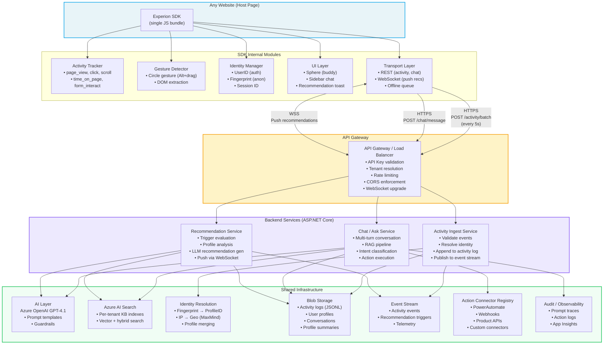

# High-Level Architecture Diagram

```mermaid
graph TB
    subgraph HOST["Any Website (Host Page)"]
        SDK["Experion SDK<br/>(single JS bundle)"]
    end

    subgraph SDK_MODULES["SDK Internal Modules"]
        AT["Activity Tracker<br/>• page_view, click, scroll<br/>• time_on_page, form_interact"]
        GD["Gesture Detector<br/>• Circle gesture (Alt+drag)<br/>• DOM extraction"]
        IM["Identity Manager<br/>• UserID (auth)<br/>• Fingerprint (anon)<br/>• Session ID"]
        UI["UI Layer<br/>• Sphere (buddy)<br/>• Sidebar chat<br/>• Recommendation toast"]
        TR["Transport Layer<br/>• REST (activity, chat)<br/>• WebSocket (push recs)<br/>• Offline queue"]
    end

    SDK --> AT
    SDK --> GD
    SDK --> IM
    SDK --> UI
    SDK --> TR

    TR -->|"HTTPS<br/>POST /activity/batch<br/>(every 5s)"| GW
    TR -->|"HTTPS<br/>POST /chat/message"| GW
    TR <-->|"WSS<br/>Push recommendations"| GW

    subgraph GATEWAY["API Gateway"]
        GW["API Gateway / Load Balancer<br/>• API Key validation<br/>• Tenant resolution<br/>• Rate limiting<br/>• CORS enforcement<br/>• WebSocket upgrade"]
    end

    GW --> AIS
    GW --> CS
    GW --> RS

    subgraph SERVICES["Backend Services (ASP.NET Core)"]
        AIS["Activity Ingest Service<br/>• Validate events<br/>• Resolve identity<br/>• Append to activity log<br/>• Publish to event stream"]
        CS["Chat / Ask Service<br/>• Multi-turn conversation<br/>• RAG pipeline<br/>• Intent classification<br/>• Action execution"]
        RS["Recommendation Service<br/>• Trigger evaluation<br/>• Profile analysis<br/>• LLM recommendation gen<br/>• Push via WebSocket"]
    end

    subgraph INFRA["Shared Infrastructure"]
        AI["AI Layer<br/>Azure OpenAI GPT-4.1<br/>• Prompt templates<br/>• Guardrails"]
        SEARCH["Azure AI Search<br/>• Per-tenant KB indexes<br/>• Vector + hybrid search"]
        ID["Identity Resolution<br/>• Fingerprint → ProfileID<br/>• IP → Geo (MaxMind)<br/>• Profile merging"]
        BLOB["Blob Storage<br/>• Activity logs (JSONL)<br/>• User profiles<br/>• Conversations<br/>• Profile summaries"]
        EVT["Event Stream<br/>• Activity events<br/>• Recommendation triggers<br/>• Telemetry"]
        ACR["Action Connector Registry<br/>• PowerAutomate<br/>• Webhooks<br/>• Product APIs<br/>• Custom connectors"]
        AUDIT["Audit / Observability<br/>• Prompt traces<br/>• Action logs<br/>• App Insights"]
    end

    AIS --> BLOB
    AIS --> EVT
    AIS --> ID
    CS --> AI
    CS --> SEARCH
    CS --> BLOB
    CS --> ACR
    CS --> AUDIT
    RS --> EVT
    RS --> BLOB
    RS --> AI
    RS --> SEARCH

    style HOST fill:#e8f4f8,stroke:#0ea5e9,stroke-width:2px
    style GATEWAY fill:#fef3c7,stroke:#f59e0b,stroke-width:2px
    style SERVICES fill:#ede9fe,stroke:#8b5cf6,stroke-width:2px
    style INFRA fill:#f0fdf4,stroke:#22c55e,stroke-width:2px
```
