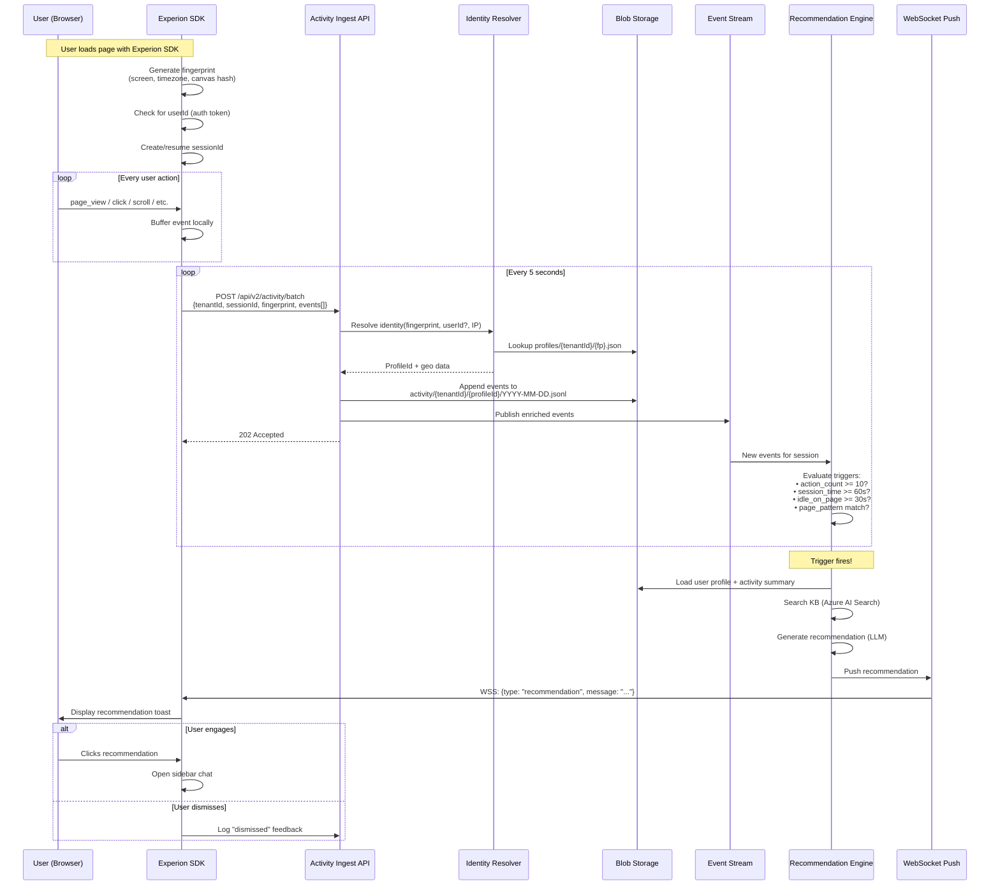

# Activity Mining Flow

```mermaid
sequenceDiagram
    participant User as User (Browser)
    participant SDK as Experion SDK
    participant API as Activity Ingest API
    participant ID as Identity Resolver
    participant Blob as Blob Storage
    participant Stream as Event Stream
    participant Rec as Recommendation Engine
    participant WS as WebSocket Push

    Note over User,SDK: User loads page with Experion SDK

    SDK->>SDK: Generate fingerprint<br/>(screen, timezone, canvas hash)
    SDK->>SDK: Check for userId (auth token)
    SDK->>SDK: Create/resume sessionId

    loop Every user action
        User->>SDK: page_view / click / scroll / etc.
        SDK->>SDK: Buffer event locally
    end

    loop Every 5 seconds
        SDK->>API: POST /api/v2/activity/batch<br/>{tenantId, sessionId, fingerprint, events[]}
        API->>ID: Resolve identity(fingerprint, userId?, IP)
        ID->>Blob: Lookup profiles/{tenantId}/{fp}.json
        ID-->>API: ProfileId + geo data

        API->>Blob: Append events to<br/>activity/{tenantId}/{profileId}/YYYY-MM-DD.jsonl
        API->>Stream: Publish enriched events
        API-->>SDK: 202 Accepted

        Stream->>Rec: New events for session
        Rec->>Rec: Evaluate triggers:<br/>• action_count >= 10?<br/>• session_time >= 60s?<br/>• idle_on_page >= 30s?<br/>• page_pattern match?
    end

    Note over Rec: Trigger fires!

    Rec->>Blob: Load user profile + activity summary
    Rec->>Rec: Search KB (Azure AI Search)
    Rec->>Rec: Generate recommendation (LLM)
    Rec->>WS: Push recommendation
    WS->>SDK: WSS: {type: "recommendation", message: "..."}
    SDK->>User: Display recommendation toast

    alt User engages
        User->>SDK: Clicks recommendation
        SDK->>SDK: Open sidebar chat
    else User dismisses
        SDK->>API: Log "dismissed" feedback
    end
```
