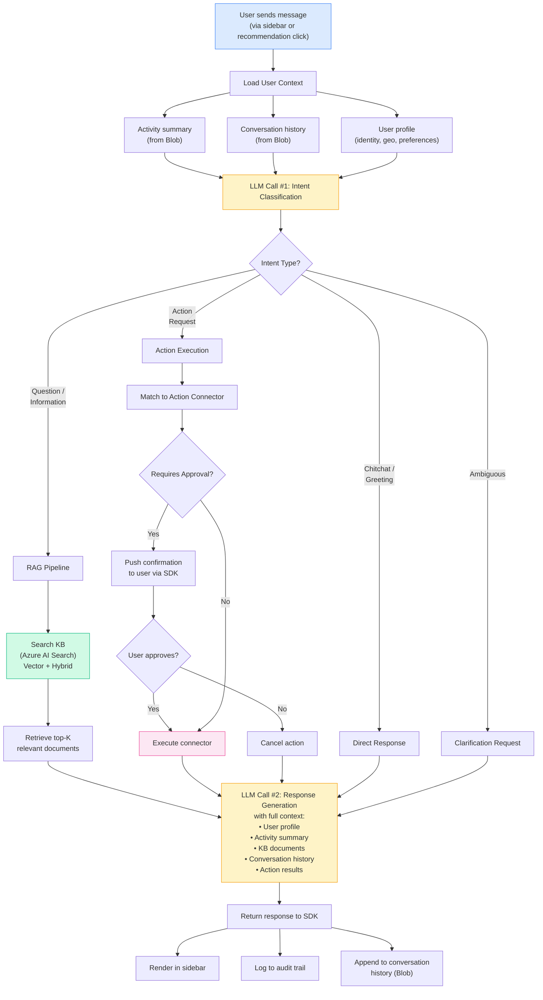

# Chat Pipeline Flow

```mermaid
flowchart TD
    A["User sends message<br/>(via sidebar or recommendation click)"] --> B

    B["Load User Context"] --> B1["Activity summary<br/>(from Blob)"]
    B --> B2["Conversation history<br/>(from Blob)"]
    B --> B3["User profile<br/>(identity, geo, preferences)"]

    B1 --> C
    B2 --> C
    B3 --> C

    C["LLM Call #1: Intent Classification"] --> D{Intent Type?}

    D -->|"Question /<br/>Information"| E["RAG Pipeline"]
    D -->|"Action<br/>Request"| F["Action Execution"]
    D -->|"Chitchat /<br/>Greeting"| G["Direct Response"]
    D -->|"Ambiguous"| H["Clarification Request"]

    E --> E1["Search KB<br/>(Azure AI Search)<br/>Vector + Hybrid"]
    E1 --> E2["Retrieve top-K<br/>relevant documents"]
    E2 --> I

    F --> F1["Match to Action Connector"]
    F1 --> F2{Requires Approval?}
    F2 -->|Yes| F3["Push confirmation<br/>to user via SDK"]
    F3 --> F4{User approves?}
    F4 -->|Yes| F5["Execute connector"]
    F4 -->|No| F6["Cancel action"]
    F2 -->|No| F5
    F5 --> I
    F6 --> I

    G --> I
    H --> I

    I["LLM Call #2: Response Generation<br/>with full context:<br/>• User profile<br/>• Activity summary<br/>• KB documents<br/>• Conversation history<br/>• Action results"]

    I --> J["Return response to SDK"]
    J --> K["Render in sidebar"]
    J --> L["Log to audit trail"]
    J --> M["Append to conversation<br/>history (Blob)"]

    style A fill:#dbeafe,stroke:#3b82f6
    style C fill:#fef3c7,stroke:#f59e0b
    style I fill:#fef3c7,stroke:#f59e0b
    style E1 fill:#d1fae5,stroke:#10b981
    style F5 fill:#fce7f3,stroke:#ec4899
```
