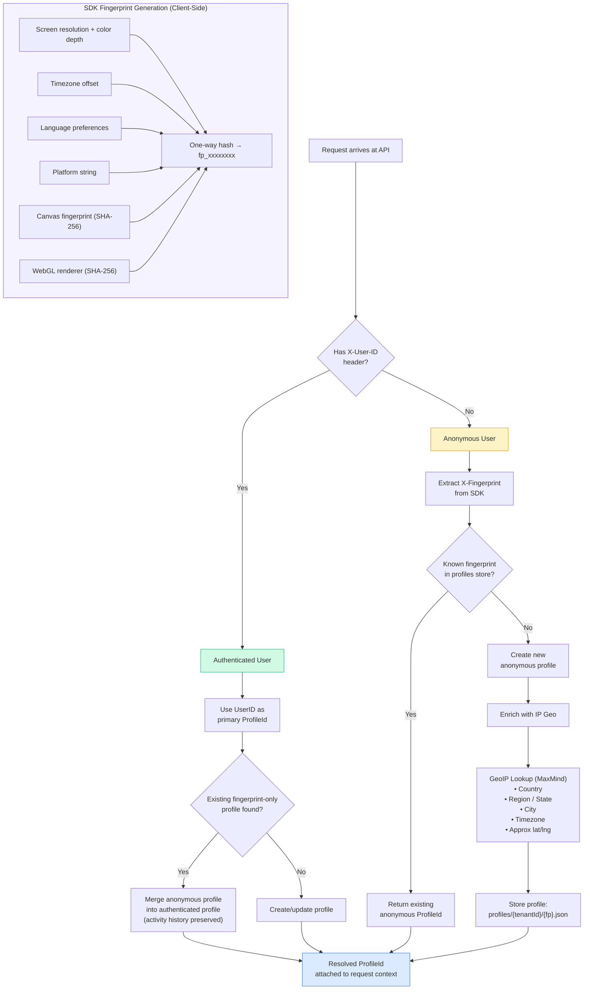

# Identity Resolution Flow

```mermaid
flowchart TD
    A["Request arrives at API"] --> B{Has X-User-ID<br/>header?}

    B -->|Yes| C["Authenticated User"]
    C --> C1["Use UserID as<br/>primary ProfileId"]
    C1 --> C2{Existing fingerprint-only<br/>profile found?}
    C2 -->|Yes| C3["Merge anonymous profile<br/>into authenticated profile<br/>(activity history preserved)"]
    C2 -->|No| C4["Create/update profile"]
    C3 --> DONE
    C4 --> DONE

    B -->|No| D["Anonymous User"]
    D --> D1["Extract X-Fingerprint<br/>from SDK"]
    D1 --> D2{Known fingerprint<br/>in profiles store?}
    D2 -->|Yes| D3["Return existing<br/>anonymous ProfileId"]
    D2 -->|No| D4["Create new<br/>anonymous profile"]
    D3 --> DONE
    D4 --> D5["Enrich with IP Geo"]
    D5 --> D6["GeoIP Lookup (MaxMind)<br/>• Country<br/>• Region / State<br/>• City<br/>• Timezone<br/>• Approx lat/lng"]
    D6 --> D7["Store profile:<br/>profiles/{tenantId}/{fp}.json"]
    D7 --> DONE

    DONE["Resolved ProfileId<br/>attached to request context"]

    subgraph SDK_FINGERPRINT["SDK Fingerprint Generation (Client-Side)"]
        FP1["Screen resolution + color depth"]
        FP2["Timezone offset"]
        FP3["Language preferences"]
        FP4["Platform string"]
        FP5["Canvas fingerprint (SHA-256)"]
        FP6["WebGL renderer (SHA-256)"]
        FP1 --> HASH["One-way hash → fp_xxxxxxxx"]
        FP2 --> HASH
        FP3 --> HASH
        FP4 --> HASH
        FP5 --> HASH
        FP6 --> HASH
    end

    style C fill:#d1fae5,stroke:#10b981
    style D fill:#fef3c7,stroke:#f59e0b
    style DONE fill:#dbeafe,stroke:#3b82f6
    style SDK_FINGERPRINT fill:#f5f3ff,stroke:#8b5cf6
```
