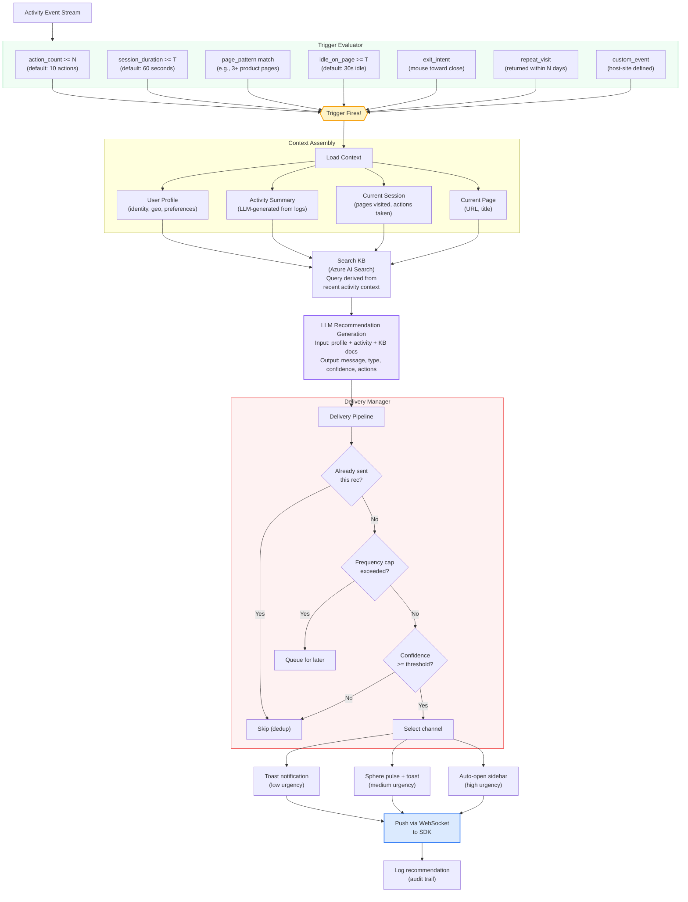

# Recommendation Engine Architecture

```mermaid
flowchart TD
    subgraph TRIGGERS["Trigger Evaluator"]
        T1["action_count >= N<br/>(default: 10 actions)"]
        T2["session_duration >= T<br/>(default: 60 seconds)"]
        T3["page_pattern match<br/>(e.g., 3+ product pages)"]
        T4["idle_on_page >= T<br/>(default: 30s idle)"]
        T5["exit_intent<br/>(mouse toward close)"]
        T6["repeat_visit<br/>(returned within N days)"]
        T7["custom_event<br/>(host-site defined)"]
    end

    EVT["Activity Event Stream"] --> TRIGGERS

    T1 --> FIRE
    T2 --> FIRE
    T3 --> FIRE
    T4 --> FIRE
    T5 --> FIRE
    T6 --> FIRE
    T7 --> FIRE

    FIRE{{"Trigger Fires!"}} --> CTX

    subgraph CTX_BUILD["Context Assembly"]
        CTX["Load Context"]
        CTX --> CTX1["User Profile<br/>(identity, geo, preferences)"]
        CTX --> CTX2["Activity Summary<br/>(LLM-generated from logs)"]
        CTX --> CTX3["Current Session<br/>(pages visited, actions taken)"]
        CTX --> CTX4["Current Page<br/>(URL, title)"]
    end

    CTX1 --> KB
    CTX2 --> KB
    CTX3 --> KB
    CTX4 --> KB

    KB["Search KB<br/>(Azure AI Search)<br/>Query derived from<br/>recent activity context"] --> GEN

    GEN["LLM Recommendation Generation<br/>Input: profile + activity + KB docs<br/>Output: message, type, confidence, actions"]

    GEN --> DEL

    subgraph DELIVERY["Delivery Manager"]
        DEL["Delivery Pipeline"]
        DEL --> DEL1{Already sent<br/>this rec?}
        DEL1 -->|Yes| DEL_SKIP["Skip (dedup)"]
        DEL1 -->|No| DEL2{Frequency cap<br/>exceeded?}
        DEL2 -->|Yes| DEL_QUEUE["Queue for later"]
        DEL2 -->|No| DEL3{Confidence<br/>>= threshold?}
        DEL3 -->|No| DEL_SKIP
        DEL3 -->|Yes| DEL4["Select channel"]
    end

    DEL4 --> CH1["Toast notification<br/>(low urgency)"]
    DEL4 --> CH2["Sphere pulse + toast<br/>(medium urgency)"]
    DEL4 --> CH3["Auto-open sidebar<br/>(high urgency)"]

    CH1 --> PUSH["Push via WebSocket<br/>to SDK"]
    CH2 --> PUSH
    CH3 --> PUSH

    PUSH --> LOG["Log recommendation<br/>(audit trail)"]

    style FIRE fill:#fef3c7,stroke:#f59e0b,stroke-width:2px
    style GEN fill:#ede9fe,stroke:#8b5cf6,stroke-width:2px
    style PUSH fill:#dbeafe,stroke:#3b82f6,stroke-width:2px
    style TRIGGERS fill:#f0fdf4,stroke:#22c55e
    style DELIVERY fill:#fef2f2,stroke:#ef4444
```
