# Storage Layout

```mermaid
graph TD
    subgraph BLOB["Azure Blob Storage"]
        subgraph TENANT["experion-data / {tenantId}"]
            subgraph PROFILES["profiles/"]
                P1["fp_abc123.json<br/>Anonymous user profile"]
                P2["user_456.json<br/>Authenticated user profile"]
            end

            subgraph ACTIVITY["activity/"]
                subgraph USER_A["fp_abc123/"]
                    A1["2026-05-01.jsonl"]
                    A2["2026-05-02.jsonl"]
                    A3["2026-05-03.jsonl"]
                end
                subgraph USER_B["user_456/"]
                    A4["2026-05-03.jsonl"]
                end
            end

            subgraph SESSIONS["sessions/"]
                S1["sess_xyz789.json"]
            end

            subgraph CONVOS["conversations/"]
                subgraph CONV_A["fp_abc123/"]
                    C1["conv_001.json"]
                    C2["conv_002.json"]
                end
            end

            subgraph SUMMARIES["summaries/"]
                SM1["fp_abc123.json<br/>LLM-generated<br/>profile summary"]
            end
        end
    end

    subgraph SEARCH["Azure AI Search"]
        IDX1["acme-corp-kb-index<br/>• title (string)<br/>• content (string)<br/>• content_vector (vector)<br/>• url (string)"]
    end

    subgraph REDIS["Azure Redis Cache (optional)"]
        R1["session:acme:sess_xyz789<br/>{actionCount, currentPage,<br/>lastActivity, recHistory}"]
    end

    subgraph SQL["SQL Server (Audit)"]
        LOG["PromptExecutionLog<br/>• All LLM calls<br/>• Action executions<br/>• Recommendation logs"]
    end

    style BLOB fill:#fff7ed,stroke:#ea580c,stroke-width:2px
    style SEARCH fill:#f0fdf4,stroke:#16a34a,stroke-width:2px
    style REDIS fill:#fef2f2,stroke:#dc2626,stroke-width:2px
    style SQL fill:#eff6ff,stroke:#2563eb,stroke-width:2px
```



## Profile JSON Structure

```json
{
  "profileId": "fp_abc123",
  "tenantId": "acme-corp",
  "type": "anonymous",
  "fingerprint": "fp_abc123",
  "userId": null,
  "createdAt": "2026-04-28T10:00:00Z",
  "lastSeenAt": "2026-05-03T08:15:00Z",
  "geo": {
    "country": "US",
    "region": "California",
    "city": "San Francisco",
    "timezone": "America/Los_Angeles",
    "lat": 37.7749,
    "lng": -122.4194
  },
  "stats": {
    "totalSessions": 5,
    "totalActions": 147,
    "totalPageViews": 42,
    "avgSessionDurationSec": 185,
    "mostVisitedPages": [
      "/products/widget-pro",
      "/pricing",
      "/docs/api"
    ]
  },
  "metadata": {}
}
```

## Activity JSONL Format (one line per event)

```
{"ts":"2026-05-03T08:01:00Z","type":"page_view","url":"/products/widget","title":"Widget Pro","ref":"google.com","sid":"sess_xyz"}
{"ts":"2026-05-03T08:01:15Z","type":"click","sel":"#add-to-cart","text":"Add to Cart","url":"/products/widget","sid":"sess_xyz"}
{"ts":"2026-05-03T08:01:20Z","type":"scroll","depth":75,"url":"/products/widget","sid":"sess_xyz"}
{"ts":"2026-05-03T08:02:30Z","type":"time_on_page","sec":90,"url":"/products/widget","sid":"sess_xyz"}
```
