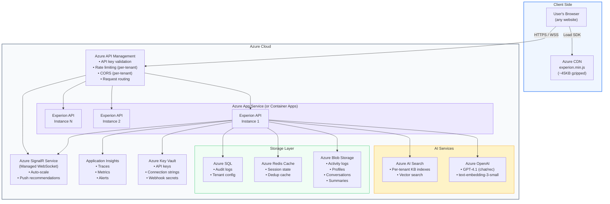

# Deployment Architecture

```mermaid
graph TB
    subgraph CLIENT["Client Side"]
        BROWSER["User's Browser<br/>(any website)"]
        CDN["Azure CDN<br/>experion.min.js<br/>(~45KB gzipped)"]
        BROWSER -->|"Load SDK"| CDN
    end

    BROWSER -->|"HTTPS / WSS"| APIM

    subgraph AZURE["Azure Cloud"]
        APIM["Azure API Management<br/>• API key validation<br/>• Rate limiting (per-tenant)<br/>• CORS (per-tenant)<br/>• Request routing"]

        subgraph APP["Azure App Service (or Container Apps)"]
            API1["Experion API<br/>Instance 1"]
            API2["Experion API<br/>Instance 2"]
            API3["Experion API<br/>Instance N"]
        end

        SIGNALR["Azure SignalR Service<br/>(Managed WebSocket)<br/>• Auto-scale<br/>• Push recommendations"]

        subgraph AI_SERVICES["AI Services"]
            AOAI["Azure OpenAI<br/>• GPT-4.1 (chat/rec)<br/>• text-embedding-3-small"]
            AIS["Azure AI Search<br/>• Per-tenant KB indexes<br/>• Vector search"]
        end

        subgraph STORAGE["Storage Layer"]
            BLOB["Azure Blob Storage<br/>• Activity logs<br/>• Profiles<br/>• Conversations<br/>• Summaries"]
            REDIS["Azure Redis Cache<br/>• Session state<br/>• Dedup cache"]
            SQL["Azure SQL<br/>• Audit logs<br/>• Tenant config"]
        end

        KV["Azure Key Vault<br/>• API keys<br/>• Connection strings<br/>• Webhook secrets"]

        AI_INSIGHTS["Application Insights<br/>• Traces<br/>• Metrics<br/>• Alerts"]
    end

    APIM --> API1
    APIM --> API2
    APIM --> API3
    APIM --> SIGNALR

    API1 --> AOAI
    API1 --> AIS
    API1 --> BLOB
    API1 --> REDIS
    API1 --> SQL
    API1 --> KV
    API1 --> AI_INSIGHTS
    API1 --> SIGNALR

    style CLIENT fill:#eff6ff,stroke:#3b82f6,stroke-width:2px
    style AZURE fill:#f8fafc,stroke:#64748b,stroke-width:2px
    style APP fill:#ede9fe,stroke:#8b5cf6
    style AI_SERVICES fill:#fef3c7,stroke:#f59e0b
    style STORAGE fill:#f0fdf4,stroke:#22c55e
```
