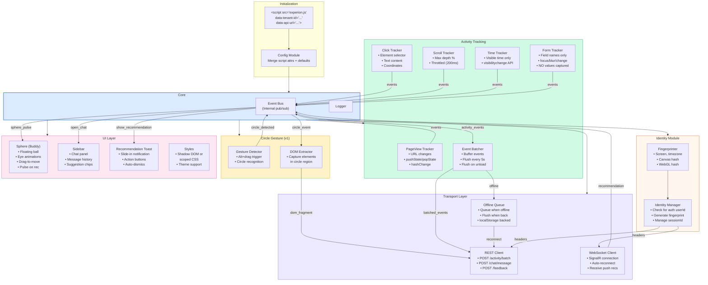

# SDK Internal Architecture

## SDK Size Budget

| Module | Estimated Size (minified + gzipped) |
|--------|-------------------------------------|
| Core (EventBus, Config, Logger) | ~2 KB |
| Identity (Fingerprinter, Manager) | ~3 KB |
| Tracking (all trackers + batcher) | ~8 KB |
| Gesture (detector + DOM extractor) | ~5 KB |
| Transport (REST + WS + offline) | ~6 KB |
| UI (Sphere + Sidebar + Toast + CSS) | ~18 KB |
| **Total** | **~42 KB** |

Target: Under 50 KB gzipped for fast loading on any website.
